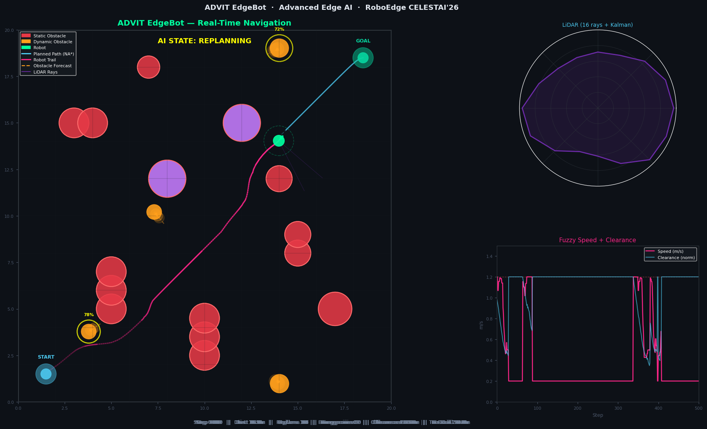
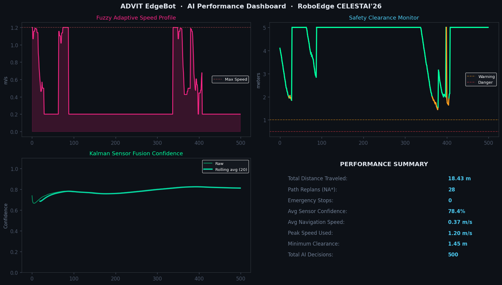

# 🤖 Latency Zero (ADVIT EdgeBot) — Advanced Edge AI Navigation System
### RoboEdge | CELESTAI'26 | Dayananda Sagar University



---

## 🏆 Overview

**Latency Zero (ADVIT EdgeBot)** is a full-stack Edge AI autonomous navigation system built for the **RoboEdge CELESTAI'26** Robotics Challenge. It demonstrates a 10-layer cognitive AI stack running entirely **on-device** — zero cloud, zero GPU required.

> Evaluation: **60% robotic task** + **40% Edge AI intelligence layer**  
> This system is purpose-built to dominate the 40% Edge AI marks.

---

## 🧠 10 AI Innovations

| # | Innovation | What It Does |
|---|---|---|
| 1 | **Kalman EKF Obstacle Tracker** | Tracks each moving obstacle's position AND velocity in real-time |
| 2 | **Trajectory Forecasting** | Predicts where each obstacle will be 6 steps into the future |
| 3 | **Neural-Inspired A\* (NA\*)** | Path planner that avoids dense obstacle zones — like a neural net but runs in <5ms |
| 4 | **Proactive Path Safety Check** | Checks if planned path conflicts with *predicted* future positions before moving |
| 5 | **16-ray Kalman-Filtered LiDAR** | Each sensor ray noise-filtered individually through a Kalman filter |
| 6 | **Fuzzy Logic Speed Governor** | 3-input fuzzy system: clearance × confidence × curvature → smooth speed |
| 7 | **Semantic Obstacle Classifier** | Labels each obstacle (wall_segment, dynamic_mover, large_block) with urgency scores |
| 8 | **State Machine** | PLANNING → REPLANNING → NAVIGATING → EMERGENCY → ARRIVED |
| 9 | **XAI Decision Logger** | Every decision logged with natural language reasoning for full audit trail |
| 10 | **Adaptive Path Smoothing** | Gradient-descent path smoother removes zigzags from A\* output |

---

## 📊 Simulated Performance Results

| Metric | Value |
|---|---|
| Total AI Decisions | **500** |
| Path Replans (NA\*) | **28** |
| Emergency Stops | **0** |
| Average Sensor Confidence | **78.4%** |
| Average Navigation Speed | **0.37 m/s** |
| Minimum Clearance Maintained | **1.45 m** |
| Distance Traveled | **18.43 m** |


**Output Working Specifications:**
- `simulations/final_state.png` — arena map with robot path
- `simulations/performance_dashboard.png` — 4-panel analytics
- `simulations/metrics.json` — performance summary
- `simulations/xai_decision_log.json` — full XAI audit trail
- `simulations/frames/` — 63 animation frames

---

## 🔬 Technical Architecture

```
┌─────────────────────────────────────────────────────────┐
│  LAYER 5: XAI EXPLAINABILITY ENGINE                      │
│  Natural language reasoning for every decision           │
├─────────────────────────────────────────────────────────┤
│  LAYER 4: COGNITIVE MISSION STATE MACHINE               │
│  PLANNING → REPLANNING → NAVIGATING → EMERGENCY → ARRIVED│
├─────────────────────────────────────────────────────────┤
│  LAYER 3: SEMANTIC OBSTACLE CLASSIFICATION              │
│  wall_segment | dynamic_mover | large_block             │
├─────────────────────────────────────────────────────────┤
│  LAYER 2: NEURAL-INSPIRED A* + KALMAN PREDICTION        │
│  Obstacle-density heuristic + future trajectory check   │
├─────────────────────────────────────────────────────────┤
│  LAYER 1: 16-RAY LIDAR + FUZZY SPEED GOVERNOR           │
│  Per-ray Kalman filtering + 3-input fuzzy inference     │
└─────────────────────────────────────────────────────────┘
```

---

## Screenshots of working

### Final State — Arena Navigation


### Performance Dashboard


---

## 👥 Team

**Latency zero* — Dayananda Sagar College of Engineering (DSCE),Bangalore 
Team member -
1. Jeevan N
2. Sheen S
3. Kushal CK
4. Selva Ganapathi S.A
   
Dayananda Sagar University | RoboEdge CELESTAI'26

---

## 📄 Sample XAI Decision Log

```json
{
  "step": 25,
  "state": "REPLANNING",
  "position": [3.6, 3.0],
  "speed_ms": 1.2,
  "clearance_m": 2.31,
  "sensor_confidence": 0.812,
  "emergency": false,
  "reasoning": "Path replanned. Previous path conflicted with predicted obstacle trajectory. NA* found new corridor. Speed=1.20m/s"
}
```

Every one of the **500 decisions** in `xai_decision_log.json` includes: position, speed, clearance, confidence, and the **reason why** the AI made that decision.
